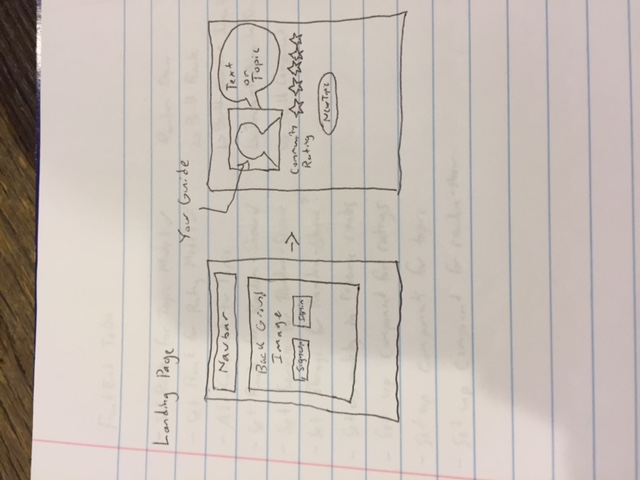
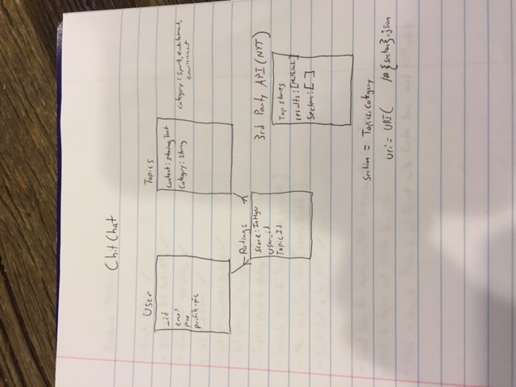
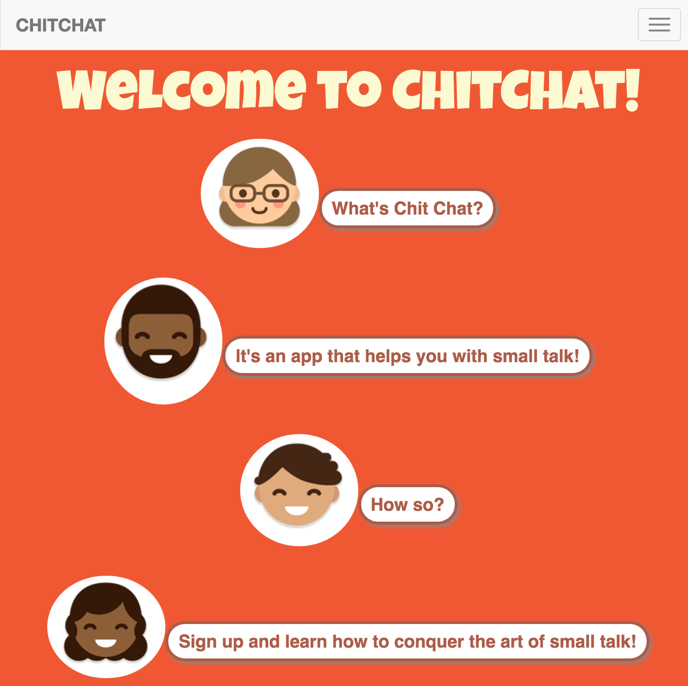
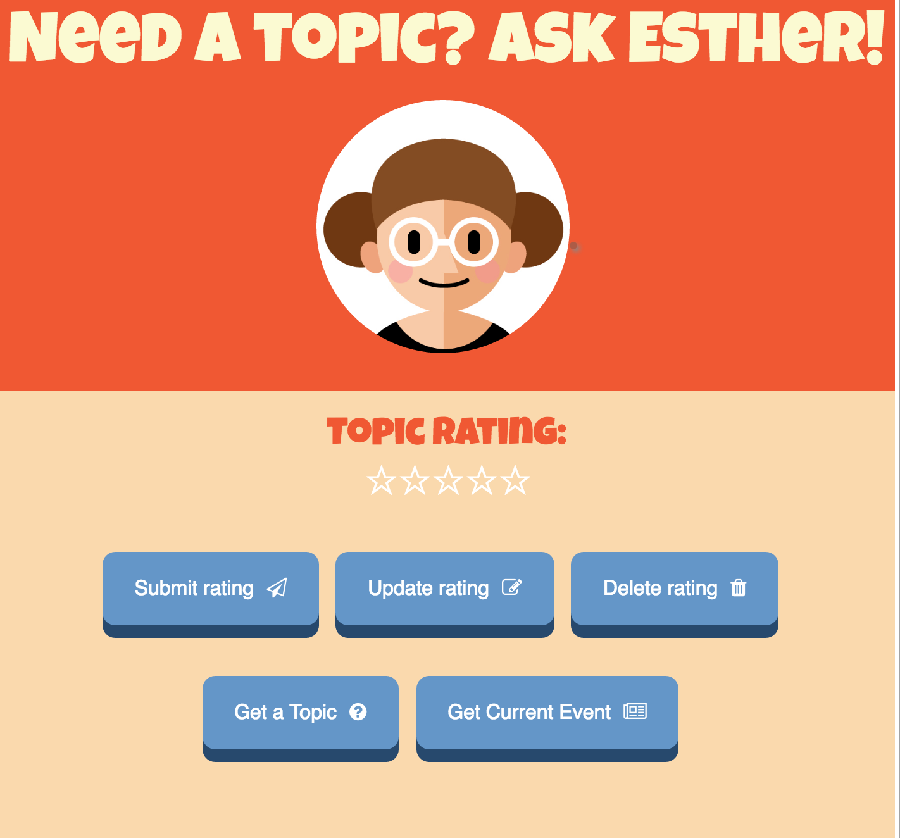

# A Random Topic Generator Web Application

A Web Application that helps users discover new
topics to use in day-to-day conversations. Purpose of the app is to help users, who would like to learn new ways to start a conversation with other people.

Link to live-application: http://rdelvallej32.github.io/chitchat-client/

Link to front end repo: https://github.com/rdelvallej32/chitchat-client

Link to back end repo: https://github.com/rdelvallej32/chitchat-api

Wireframes:

ERD:

##### Screenshot of the App:

Landing Page:

Home Page:

##### Pitchdeck:

https://www.dropbox.com/s/12ksc996584c0ym/ChitChat.key.zip?dl=0

##### Technologies used (back end):

Ruby, Rails

PostgreSQL

New York Times API

##### Technologies used (front end):

Javascript, jQuery, AJAX

HTML 5 / CSS 3

Bootstrap

Handlebars

#### General Approach:

I first spent the first day figuring out the ERD of my back end along with what properties I wanted my data to be. Afterwards, I spent time scaffolding the necessary controllers and models for my app. Once I had the basic setup along with the associations, I tested my CRUD with curl scripts. Next, I spent time researching 3rd Party APIs that would compliment my application. Once I found the NYT API, I created a custom controller action and tested it with CURL. Next, I spent time creating a custom controller action that gets a random topic.
After all of my CURL requests worked, I moved on to the front end of the application.

To start the front end, I drew up a really simple wireframe to structure my layout. I quickly added the User authentication and tested it within the browser. Afterwards, I added the feature that gets a random topic and made handlebars render the information onto the page. Next, I added the ratings feature along with the CRUD actions for ratings. Once this was tested and working, I moved on to styling my web app with CSS and adding simple UI touches.

#### Notes:

Unsolved Problems: Speech bubbles need to look like speech bubbles, need to create a favorites section.

Go Forward Ideas:

- Include Twitter API to show trending topics
- Feature that allows avatar to change facial expressions on certain events.
- Feature that has speech bubbles look like speech bubbles
- Including more information on landing page
- Feature that allows users to save favorite topics
- Feature allows user to choose their avatar

#### User Stories:

- As a user, I want to be able to receive small talk topics when I click a button.
- As a User, I want one small talk topic to appear after I click the button.
- As a User, I want to be able to generate another topic in case I am not satisfied.
- As a User, I want to see how people rated the topic right below the topic.
- As a User, I want to see the ratings in one area.
- As a User, I want to be able to rate the topic I after I see it.
- As a User, I want to be able to favorite a topic or bookmark.

Created for Project 4 in General Assembly Boston's Web Development Immersive course.
